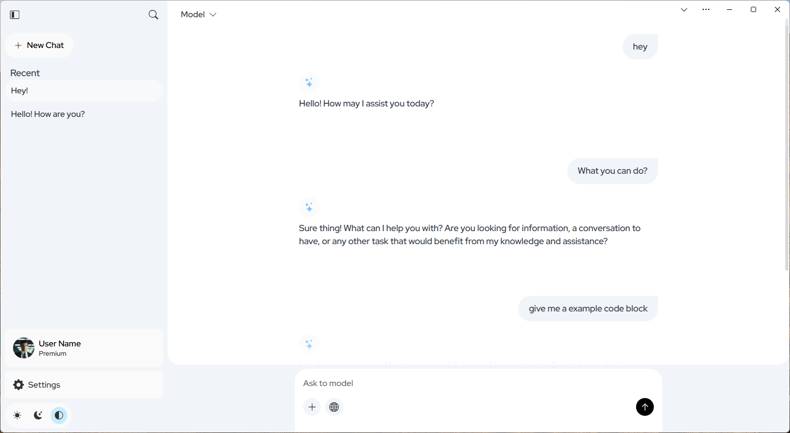

# AI Chat UI for Local LLM

A modern, responsive chat interface for AI conversations using local Large Language Models like Ollama.



## Quick Start

1. Configure Ollama for cross-origin requests:

   **Windows**

   ```batch
   setx OLLAMA_ORIGINS "*"
   ```

   **MacOS**

   ```bash
   launchctl setenv OLLAMA_ORIGINS "*"
   ```

   **Linux**

   ```bash
   sudo systemctl edit ollama.service
   # Add under [Service]:
   Environment="OLLAMA_ORIGINS=*"
   
   sudo systemctl daemon-reload
   sudo systemctl restart ollama
   ```

2. Restart the Ollama application
3. Visit [Chat UI](https://aichatui.layx.xyz)
4. Install as PWA (optional)

> ⚠️ Requires Ollama running locally

## Features

- 🎨 Modern UI with Light/Dark themes
- 📱 Responsive design & PWA support
- 🔄 Real-time streaming responses
- 💾 Local chat history
- ⚡ Zero dependencies

## Tech Stack

- HTML5/CSS3
- Vanilla JavaScript (ES6+)
- Service Workers

## Project Structure

```
AI_Chat_UI/
├── assets/           # Static assets
├── layx/            # Framework
└── pages/           # Static pages
```

## Development

### Theme Customization

Edit variables in:

- `/layx/main/base/variable.css`
- `/layx/main/base/variable_color.css`

### UI Customization

Modify:

- `assets/css/chat_app/main.css`
- `assets/js/chat_app/main.js`

## Browser Support

- Chrome/Edge/Firefox/Safari (latest versions)

## Contributing

1. Fork repository
2. Create feature branch
3. Submit pull request

## License

MIT License

---

## Roadmap

- Multi-LLM support
- Enhanced UI customization
- Voice I/O